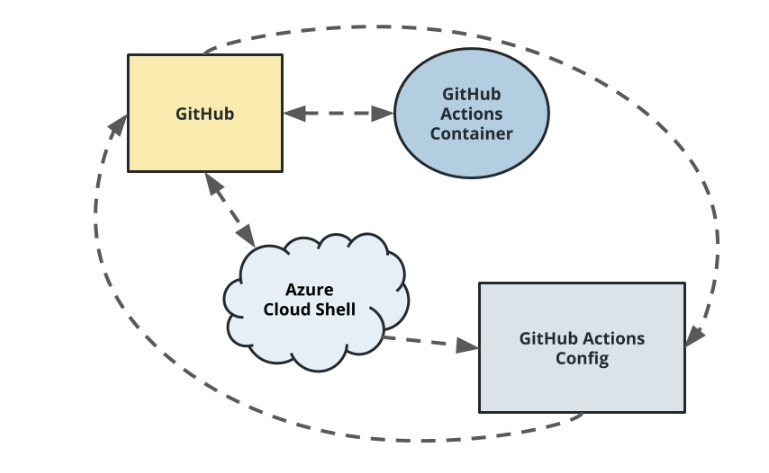
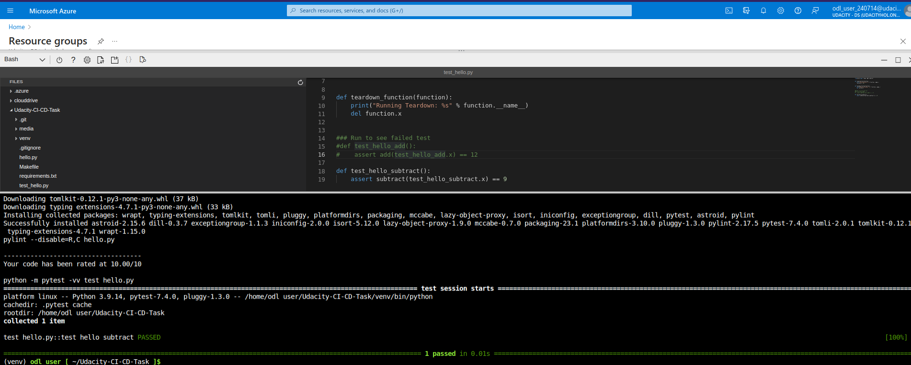
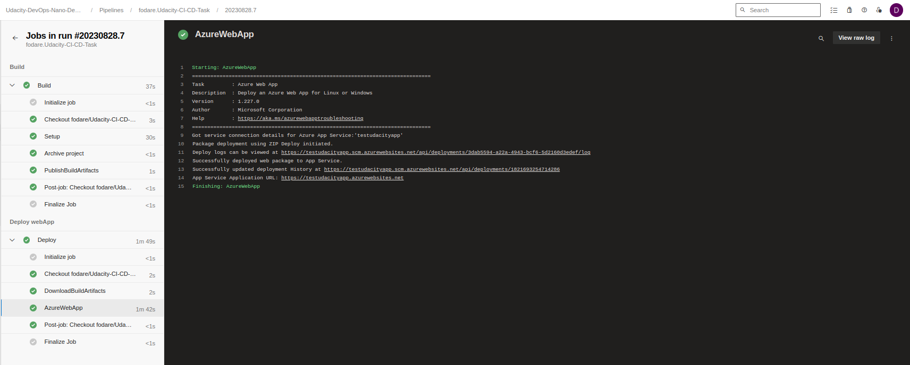
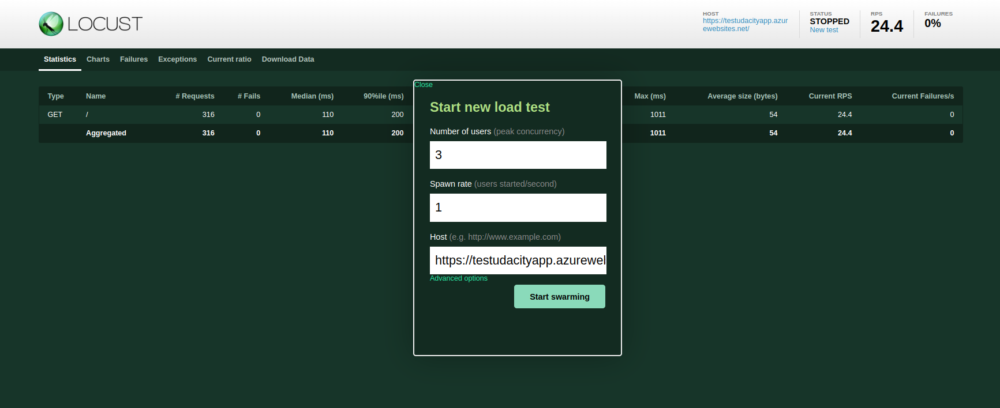
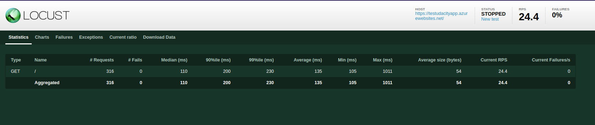

# Overview

[](https://github.com/fodare/Udacity-CI-CD-Task/actions/workflows/pythonapp.yml)

## Project Plan

* A link to a Trello board for the project: [Trello board link](https://trello.com/invite/b/lahjb0u0/ATTI7b5a3b2eb353ea99def3bc28db5a18ecBBE3A434/udacity-task2-demoboard)
* A link to a spreadsheet that includes the original and final project plan. See attachment in Trello [project plan](https://trello.com/1/cards/64ebc8e797252a845d398dd0/attachments/64ebcb0fc0035f304185f64b/download/project-management-template.ods) task.

## Instructions

* Architectural Diagram (Shows how key parts of the system work)



## Local testing

* Log into Azure portal: [Azure portal](https://portal.azure.com/)

* Create new bash cloud shell. From the top right menu of the portal, click on the cloud shell button .

* Once in the bash cloud shell, you can clone the project starter files [here](https://github.com/udacity/nd082-Azure-Cloud-DevOps-Starter-Code/tree/master/C2-AgileDevelopmentwithAzure/project/starter_files)

* From the bash terminal, run the commands below.

  * ```python
    cd ~./flask-sklearn

    # Creates a python virtual enviroment.
    python3 -m venv venv

    # Activate the virtual enviroment.
    source venv/bin/activate
    ```

* Run `Makefile`. Within the project file is a `Makefile` to help install, lint and test project source code. To run the commands within the file, execute the command below within your bash terminal. Command execution command should look something like below.

  * ```python
    make all
    ```

* Output of a test run


* To successfully deploy the project using Azure Pipelines. Run the command below:

  * ```python
    # Create a test resource group
    az group create -l westus -n test-rg

    # From the bash terminal. Ensure you are in the flask-sklearn dir
    az webapp up -g test-rg -n {azure unique app service name}
    ```

* To support automatic CI-CD workflow. Create an azure pipeline, see template below.

  * ```python
    # Sample Azure CI-CD pipeline
    trigger:

    * main

    pool:

    # vmImage: ubuntu-latest

    name: Default

    variables:

    * name: "azureServiceConnectionId"
        value: "Tem-Azure-connection"
    * name: "webappName"
        value: "testudacityapp."
    * name: "environmentName"
        value: "flask-ml-service"
    * name: "projectRoot"
        value: $(System.DefaultWorkingDirectory)/flask-sklearn

    stages:

    * stage: Build
        jobs:
    * job: Build
            displayName: Build
            steps:
        * script: |
                make setup
                source venv/bin/activate
                make install
                make lint
                displayName: Setup
                workingDirectory: $(projectRoot)

        * task: ArchiveFiles@2
                displayName: "Archive project"
                inputs:
                rootFolderOrFile: $(projectRoot)
                includeRootFolder: false
                archiveType: 'zip'
                archiveFile: '$(Build.ArtifactStagingDirectory)/$(Build.BuildId).zip'
                replaceExistingArchive: true

        * task: PublishBuildArtifacts@1
                inputs:
                PathtoPublish: '$(Build.ArtifactStagingDirectory)/$(Build.BuildId).zip'
                ArtifactName: 'drop'
                publishLocation: 'Container'

    * stage: Deploy
        displayName: "Deploy webApp"
        dependsOn: Build
        condition: succeeded()
        jobs:
    * job: Deploy
            steps:
        * task: DownloadBuildArtifacts@1
                inputs:
                buildType: 'current'
                downloadType: 'single'
                artifactName: 'drop'
                downloadPath: '$(Build.ArtifactStagingDirectory)'
        * task: AzureWebApp@1
                inputs:
                azureSubscription: 'Tem-Azure-connection'
                appType: 'webAppLinux'
                appName: 'testudacityapp'
                package: '$(Build.ArtifactStagingDirectory)/drop/$(Build.BuildId).zip'
    ```

  * Ensure you create your service connection and update the field `azureSubscription` with your service connection name. See supporting documentation [here](https://learn.microsoft.com/en-us/azure/devops/pipelines/library/service-endpoints?view=azure-devops&tabs=yaml)

  A successful azure pipeline run should look something like below.
  
  
  You can also run a quick load test against the deployed app by running the `locustfile.py` script. To do this, simply follow the command below.
  
  * From you local machine CLI, run the commands

    ```python
    # Activate python virtual enviroment
    source venv/bin/activate

    # From the dir flask-sklearn
    cd flask-sklearn

    # Start locust and access the frontend app via your browser(http://localhost:8089/#)
    locust
    ```

    * locust test should look like below.
    
    

* Call the prediction API. From the bash terminal, edit the placeholder value with the app service name in the `flask-sklearn/make_predict_azure_app.sh` file

  * The output should loo like below:

    ```bash
    udacity@Azure:~$ ./make_predict_azure_app.sh
    Port: 443
    {"prediction":[20.35373177134412]}
    ```

## Enhancements

* Make a new endpoint / resource that returns predictions rather than using shell commands.

* Perhaps split the frontend and the prediction service into microservices.
